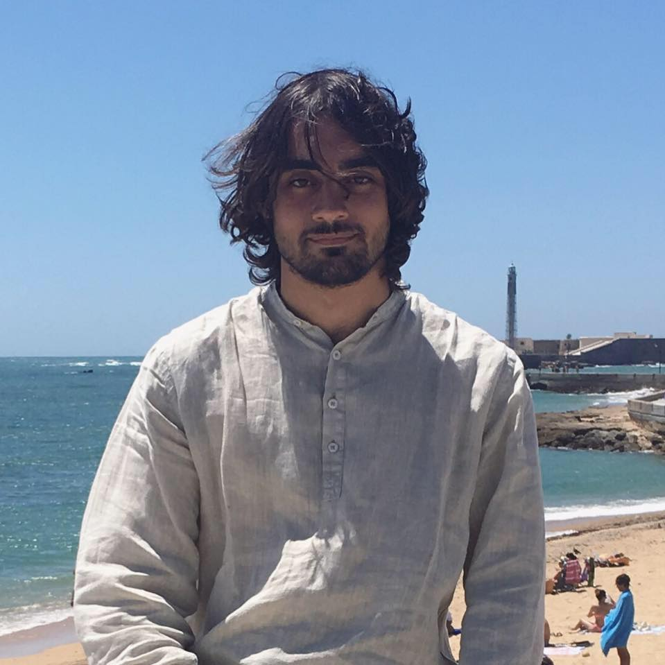

## Welcome to my personal blog

  

Hi! My name is Omar, and I was born in Ibiza (Spain) in 1996.
I studied Computer Science at Barcelona School of Informatics, a faculty of Universitat Politecnica de Catalunya, where I choose the Computation branch.

My main interests right are Statistics, Data Science (exploratory analyisis, visualization, etc.) and also Machine Learning modeling.

I have been teaching for 2 years now numerous languages to college students, including C, C++, Java, Python and R. Also I have conducted several courses in algorithmics and complexity analysis.

In my spare time I like to play classical guitar, and also fence 🤺

## Data Science portfolio
- [Text Mining The Name of The Wind](https://norhther.github.io/blog/posts/notw.html), tidyverse/tidytext approach (R) - 27/04/2020
